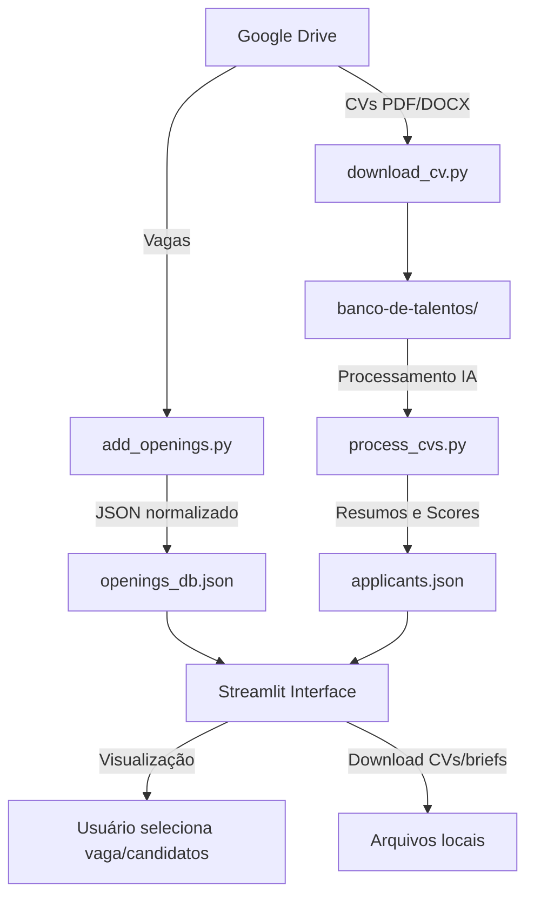

# CV Analyser


Sistema para análise de currículos, extração de dados de vagas e classificação de candidatos utilizando IA (Groq) e Streamlit.

---

## 📂 Estrutura do Projeto

```bash
cv-analyser/
│
├─ streamlit_app.py        # Interface Streamlit
├─ process_cvs.py          # Processamento de CVs via IA
├─ add_openings.py         # Processamento de vagas via IA
├─ download_cv.py          # Baixa CVs do Google Drive
├─ config_init.py          # Inicializa config.ini
├─ config.ini              # IDs do Google Drive
├─ database.py             # Gerencia TinyDB
├─ pyproject.toml          # Configuração do projeto
├─ poetry.lock             # Lockfile do Poetry
├─ .env                    # Variáveis de ambiente (Groq API)
├─ token.json              # Credenciais OAuth
├─ credentials.json        # Client secrets OAuth
├─ banco-de-talentos/      # CVs baixados do Drive
├─ openings_db.json        # Banco de vagas
├─ applicants.json         # Banco de candidatos processados
├─ ai_prompts.py           # Prompts para IA
├─ utils_cv.py             # Funções utilitárias para CVs
└─ models/
    ├─ analysis.py
    ├─ brief.py
    ├─ file.py
    └─ opening.py
└─ drive/
    └─ authenticate.py     # Autenticação Google Drive
````

---

## 🔄 Fluxo do Sistema



---

## ⚡ Comandos Principais

| Ação                    | Comando                                                                                                  |
| ----------------------- | -------------------------------------------------------------------------------------------------------- |
| Criar ambiente virtual  | `python -m venv venv` <br> `source venv/bin/activate` (Linux/Mac) <br> `venv\Scripts\activate` (Windows) |
| Instalar dependências   | `poetry install` <br> ou `pip install -r requirements.txt`                                               |
| Configurar Google Drive | `python config_init.py`                                                                                  |
| Autenticar Google Drive | `python drive/authenticate.py`                                                                           |
| Processar vagas         | `python add_openings.py`                                                                                 |
| Baixar CVs              | `python download_cv.py`                                                                                  |
| Processar CVs           | `python process_cvs.py`                                                                                  |
| Executar Streamlit      | `streamlit run streamlit_app.py`                                                                         |

---

## ⚙️ Configuração

**API Groq**
Crie `.env` na raiz:

```env
GROQ_API_KEY=your_groq_api_key_here
```

**IDs Google Drive**

```bash
python config_init.py
```

* Informe ID da pasta de vagas e de CVs
* Arquivo `config.ini` será atualizado automaticamente

---

## 📌 Notas

* Textos normalizados (`Ç → C`, remoção de acentos)
* IA via `GroqClient` com retries
* `TinyDB` para persistência
* Google Drive requer IDs corretos
* IA pode retornar campos vazios
* `.env` obrigatório para API Groq

---

## 📦 Dependências

`streamlit`, `streamlit-aggrid`, `tinydb`, `pydantic`, `langchain-groq`, `python-dotenv`, `requests`, `utilz`, `utils`, `pymupdf`, `python-docx`, `chardet`, `google-api-python-client`, `google-auth-oauthlib`, `google-auth-httplib2`

---

## 📞 Contato

* Autor: Messer
* Email: [claraborgespsic@gmail.com](mailto:claraborgespsic@gmail.com)
* Projeto: `cv-analyser`

---

## 📝 Licença

MIT License
